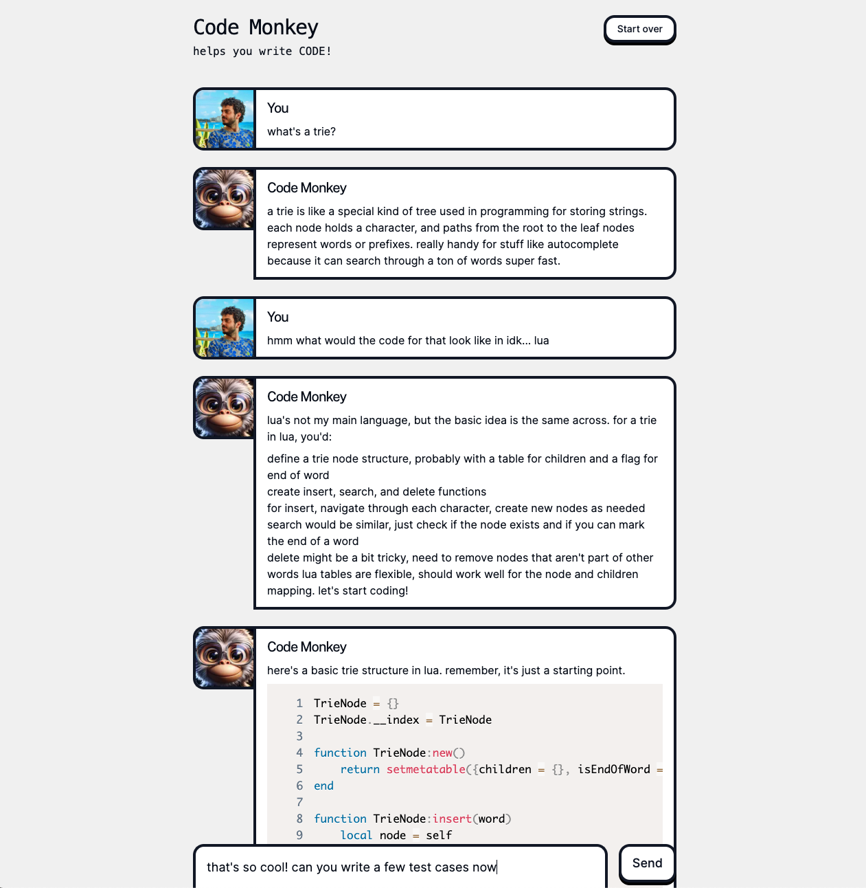

# Code Monkey

This is an example project to demonstrate how to connect a Next.js project to the Soul Engine.

## 💬 Example interaction

## Running this project

1. Make sure you first run the soul using the debugger (see the soul's [README.md](soul/README.md))
1. Go into the `web` directory
1. Create a `.env` file using `env.sample` as a template
1. Run `npm i && npm run dev`
1. Open [http://localhost:3000](http://localhost:3000) with your browser.
